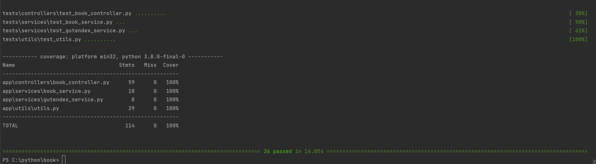
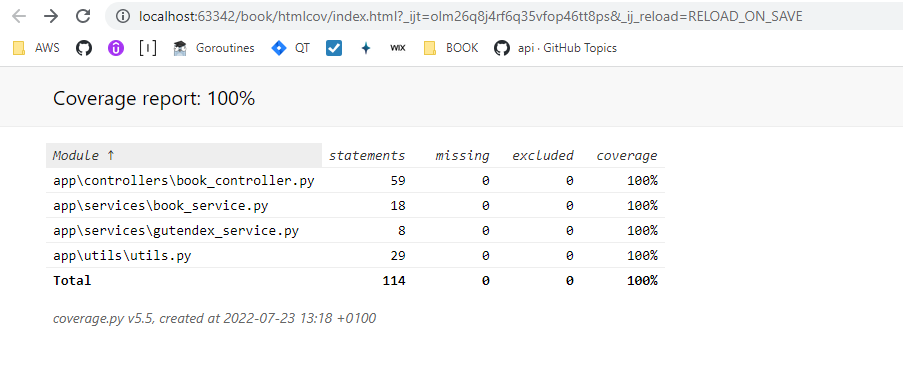

# <center>BOOK API</center>


### STACK
```commandline
Python 3.9
Flask 2.1.3
MySQL 5.7
Redis 5
Peewee 3.15.1
Docker
```

### To run PyTests
```commandline
pytest --cov=app
```
<p align="center">
   
</p>

```commandline
pytest --cov=app tests/ --cov-report=html
```
<p align="center">
   
</p>

### To create a book application on docker, you need to have a docker installed in your machine and run this command inside book directory.

```commandline
docker-compose up --build
```

# <center>ARCHITETURE</center>
<p align="center">
   
</p>

# <center>DRAW.IO FILE</center>
- Draw.io file: [LINK](./docs/books.drawio)


# <center>POSTMAN FILE</center>
- Postman file: [LINK](./docs/books.postman_collection.json)

# <center>APIS</center>

### GET - /book/book-by-title/< title >
### Path Parameter: title {STRING}
### Query Parameter: page {INT}
#### to go and back in case exists next or previous pages


#### RESPONSE: 200
```json
{
    "next": null,
    "previous": null,
    "books": [
        {
            "id": 41017,
            "title": "South Africa and the Transvaal War, Vol. 5 (of 8): From the Disaster at Koorn Spruit to Lord Roberts's Entry into Pretoria",
            "authors": [
                {
                    "name": "Creswicke, Louis",
                    "birth_year": null,
                    "death_year": null
                }
            ],
            "languages": [
                "en"
            ],
            "download_count": 65
        },
        {
            "id": 17786,
            "title": "Mga Dakilang Pilipino; o ang kaibigan ng mga nagaaral",
            "authors": [
                {
                    "name": "Sevilla, Jose N.",
                    "birth_year": 1880,
                    "death_year": 1946
                }
            ],
            "languages": [
                "tl"
            ],
            "download_count": 65
        }
    ]
}
```


### POST - /book/create-book-review-and-rating
#### REQUEST
```json
{
    "book_id": 5,
    "rating": 2,
    "review": "Este livro eh medio 2"
}
```
#### RESPONSE: 200
```json
{
    "id": 1,
    "book_id": 5,
    "rating": 2,
    "review": "Este livro eh medio 2"
}
```

### GET - /book/book-details-and-rating/< book_id >
### Path Parameter: book_id {INT}
#### RESPONSE: 200
```json
{
    "id": 84,
    "title": "Frankenstein; Or, The Modern Prometheus",
    "authors": [
        {
            "name": "Shelley, Mary Wollstonecraft",
            "birth_year": 1797,
            "death_year": 1851
        }
    ],
    "languages": [
        "en"
    ],
    "download_count": 17482,
    "rating": 3.7,
    "reviews": [
        "Este livro eh mais ou menos...2",
        "Este livro eh mais ou menos...1",
        "Este livro eh bom demais 5",
        "Este livro eh bom 4",
        "Este livro eh medio 3",
        "Este livro eh medio 3",
        "Este livro eh medio 3",
        "Este livro eh medio 3",
        "Este livro eh medio 3"
    ]
}
```

### GET - /book/book-top-number-average-rating/< number >
#### Path Parameter: number {INT} is a value in query LIMIT
#### RESPONSE: 200
```json
{
    "message": "rating top 5 average",
    "ratings": [
        {
            "book_id": 1,
            "rating": 5
        },
        {
            "book_id": 2,
            "rating": 4
        },
        {
            "book_id": 84,
            "rating": 3
        },
        {
            "book_id": 4,
            "rating": 1
        },
        {
            "book_id": 3,
            "rating": 1
        }
    ]
}
```


### GET - /book/book-top-month-average-rating/< month >
#### Path Parameter: month {INT} is a value between 1-12 of months
#### RESPONSE: 200
```json
{
    "message": "rating top avg by July ",
    "ratings": [
        {
            "book_id": 1,
            "rating": 5
        },
        {
            "book_id": 2,
            "rating": 4
        },
        {
            "book_id": 84,
            "rating": 3
        },
        {
            "book_id": 4,
            "rating": 1
        },
        {
            "book_id": 3,
            "rating": 1
        }
    ]
}
```